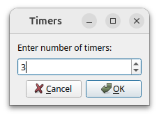
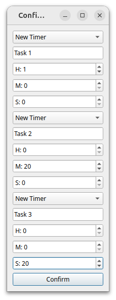
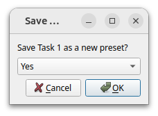
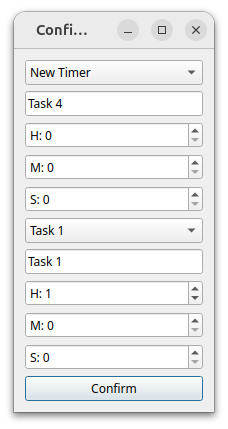
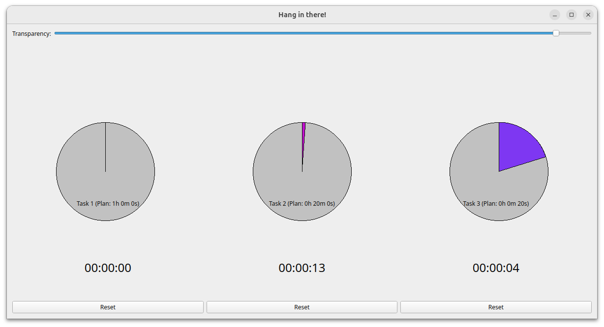

# Daily Multi-Task Customizable Timer

## Description

This application is ideal for individuals who struggle with maintaining focus on a single task for extended periods. It helps users allocate fixed daily durations to multiple tasks and switch between them dynamically, ensuring freshness and motivation.

This Python application allows users to create customizable timers with pie-chart representations. Users can:

- Define the number of timers.
- Set timer names and durations (in hours, minutes, and seconds).
- Save and reuse timer presets.
- Adjust transparency dynamically using a slider.
- Use a pie-chart visualization for each timer, which updates based on elapsed time.

## Features

1. **Timer Presets**:

   - Save up to 5 timer configurations (name and duration).
   - Easily reuse saved presets.

2. **Pie Chart Representation**:

   - Each timer displays a pie chart indicating progress.
   - Unique, randomly generated colors for each pie chart.

3. **Dynamic Adjustments**:

   - Adjust window transparency using a slider.
   - Timers are always on top of other windows for quick access.

4. **User-Friendly Interface**:

   - Simple controls for starting, pausing, and resetting timers.
   - Text labels for timer names, planned duration, and elapsed time.

---

## Environment Setup

### Dependencies

- Python 3.7 or above
- PyQt5 library

### Installation

1. **Clone the Repository**:

   ```bash
   git clone https://github.com/ZiaPlanet/Daily-Multi-Task-Timer.git
   cd timer-app
   ```

2. **Install Required Dependencies**:
   Use `pip` to install PyQt5:

   ```bash
   pip install PyQt5
   ```

3. **Run the Application**:

   ```bash
   python timer_app.py
   ```

---

## Usage

1. **Start the App**:

   - Run the script `timer_app.py`.
   
   

2. **Define Timers**:

   - Specify the number of timers to create.
   - For each timer:
     - Select from a dropdown of saved presets or create a new one.
     - Input timer name and duration.
<div style="display: flex; justify-content: space-around;">
    
    
    
</div>

3. **Control Timers**:

   - Click on a pie chart to start/stop the timer.
   - Reset timers using the reset button.
   

4. **Adjust Transparency**:

   - Use the transparency slider to set the desired window opacity.

 

## File Structure

```
├── README.md           # Documentation
timer-app/
    ├── timer_app.py        # Main application code
    ├── timer_configs.json  # Stores saved timer presets
```

---

## To Do

- Add support for additional timer styles.
- Enhance UI/UX for better timer management.

---

## License

This project is licensed under the MIT License.

---

# 日常多任务可自定义计时器

## 描述

本应用非常适合需要在多个任务之间灵活切换的用户。它帮助用户为多个任务分配每日固定时长，并在任务间随时切换，以保持新鲜感和动力。它帮助用户为多个任务分配每日固定时长，并在任务间随时切换，以保持新鲜感和动力。

该应用程序允许用户创建带有饼状图表示的可自定义计时器。用户可以：

- 定义计时器数量。
- 设置计时器名称和持续时间（时、分、秒）。
- 保存并重复使用计时器预设。
- 使用滑块动态调整透明度。
- 每个计时器都有可视化饼状图显示其进度。

## 功能

1. **计时器预设**：

   - 保存多达 5 个计时器配置（名称和持续时间）。
   - 快速加载已保存的预设。

2. **饼状图表示**：

   - 每个计时器显示一个饼状图，指示进度。
   - 饼状图颜色随机生成。

3. **动态调整**：

   - 使用滑块调整窗口透明度。
   - 窗口始终保持在最前方，方便访问。

4. **用户友好的界面**：

   - 简单的计时器控制（启动、暂停、重置）。
   - 文本标签显示计时器名称、计划时长和已用时间。

---

## 环境设置

### 依赖项

- Python 3.7 或更高版本
- PyQt5 库

### 安装步骤

1. **克隆代码库**：

   ```bash
   git clone https://github.com/ZiaPlanet/Daily-Multi-Task-Timer.git
   cd timer_app
   ```

2. **安装必要依赖项**：
   使用 `pip` 安装 PyQt5：

   ```bash
   pip install PyQt5
   ```

3. **运行应用程序**：

   ```bash
   python timer_app.py
   ```

---

## 使用方法

1. **启动应用程序**：

   - 运行 `timer_app.py`。

2. **定义计时器**：

   - 指定计时器数量。
   - 对于每个计时器：
     - 从预设下拉菜单中选择，或创建新计时器。
     - 输入计时器名称和持续时间。

3. **控制计时器**：

   - 点击饼状图启动/停止计时器。
   - 使用重置按钮重置计时器。

4. **调整透明度**：

   - 使用透明度滑块设置窗口不透明度。

---

## 文件结构

```
├── README.md           # Documentation
timer-app/
    ├── timer_app.py        # 主程序代码
    ├── timer_configs.json  # 保存计时器预设
```

---

## 待办事项

- 支持更多计时器样式。
- 改进 UI/UX 以增强计时器管理。

---

## 许可证

本项目使用 MIT 许可证。

